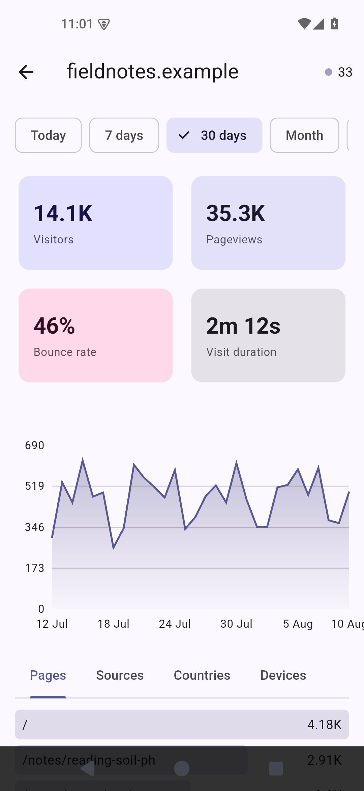
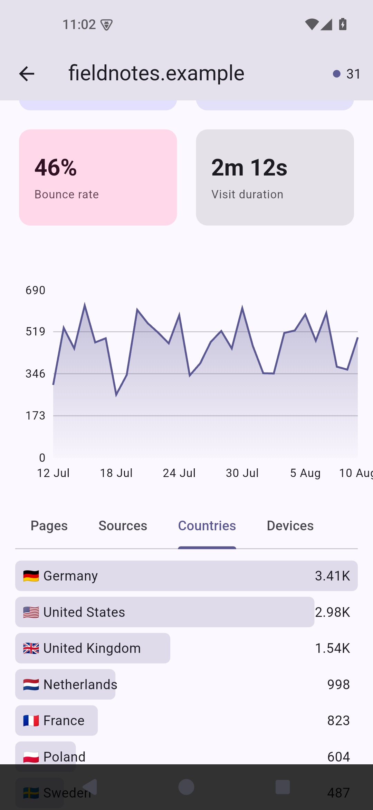
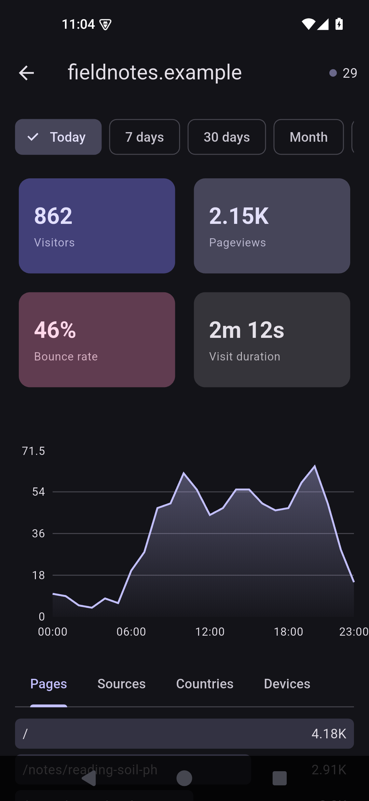

<p align="center">
  
</p>

# Drausible

Unofficial Android app for [Plausible Analytics](https://plausible.io) statistics.
Hook up your own Community Edition server (or use cloud).
You have to add the sites manually, as this API call is only availble for Enterprise subscription.

| Overview | Countries | Dark theme |
| --- | --- | --- |
|  |  |  |

## What it shows

It is mostly replicating the web view:

- visitors, visits, pageviews, views per visit, bounce rate and average visit duration
- visitors over time as a chart, bucketed hourly when the range is a single day
- top pages, sources and countries, plus devices with a switch between device type, browser and OS
- how many people are on the site right now, refreshed every 30 seconds while the screen is open

## Setting it up

1. Create a stats API key in your Plausible account settings.
2. Add a server in Drausible: a name, the base URL (`https://plausible.io` or your own host), and
   the key.
3. **Add a site by its site ID**. That is the domain exactly as it is registered in Plausible, which is
   not always the host name you would type into a browser.
   A 401 on a site that exists usually means the ID is off by something small.

Sites should be manually added. Listing them needs the Sites API, which is an Enterprise feature on plausible.io and is missing from Community Edition entirely.

### Tor (or not)

Every server can have its own SOCKS5 proxy, so a `.onion` address works if you have [Orbot](https://guardianproject.info/apps/org.torproject.android/) running.
Set the proxy to `127.0.0.1:9050`. The proxy field needs a literal IP address; the server URL behind it can be any host name, `.onion` included.

### Plain HTTP

The app allows cleartext connections, because self-hosted instances on a home network often run without TLS. Use `https://` wherever you have the option.

### Rate limits

Plausible cloud allows 600 requests an hour per key. The app caches answers for a minute, loads a breakdown tab only when you open it, and after a 429 leaves that server alone for ten minutes rather than polling its way into a longer lockout.

## Which API it uses

The app tries `POST /api/v2/query` first. Servers old enough to 404 on it fall back to the v1 stats endpoints, and the app remembers which one each server speaks. After you upgrade a server, "Re-check" on the server screen forgets that and probes again. Live visitor counts always come from v1, since v2 never got an equivalent.

## Building

Flutter is pinned in `.fvmrc` to the 3.32 line. Newer versions require minSdk 24, and this app runs on Android 5.0.

```
flutter pub get --enforce-lockfile
flutter build apk --release --split-per-abi
```

Release builds use the project key when `android/key.properties` is present and the debug key
otherwise, so an APK you build yourself will not install over a published one.

## Installing

[](https://f-droid.org/packages/io.github.cheesymoon.drausible/)
[](https://apt.izzysoft.de/fdroid/index/apk/io.github.cheesymoon.drausible)

F-Droid, IzzyOnDroid and the GitHub release carry the same signature, so users can switch between
them freely. IzzyOnDroid serves the arm64-v8a APK; armeabi-v7a users should use F-Droid or the
GitHub release.

## License

GPL-3.0-or-later. See [LICENSE](LICENSE).
